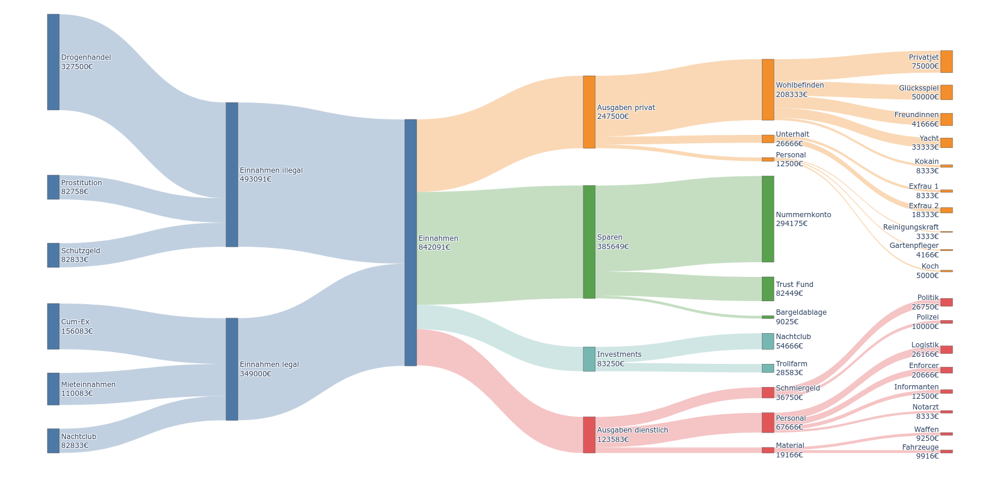

# hibiscus-sankey

Creates sankey plot from Hibiscus/Jameica `csv` export.

The categories assigned in Hibiscus are shown as Sankey nodes.

## Example

```
$ hibiscus_sankey --div 12 --plot demo.csv
```



## Usage

```
$ hibiscus_sankey --help
usage: hibiscus_sankey [-h] [--div DIV] [--threshold THRESHOLD] [--plot] csv_files [csv_files ...]

Generate a Sankey diagram from one or more CSV files (category path based).

positional arguments:
  csv_files             One or more CSV files

options:
  -h, --help            show this help message and exit
  --div DIV             Divisor for values (e.g. 12 to show monthly averages from a one year dataset)
  --threshold THRESHOLD
                        Lower threshold for nodes to show up
  --plot                Plot sankey diagram
```

## How to obtain CSV source

`hibiscus_sankey` uses one or more transactions export files from Hibiscus. Note there have to be transactions assigned to categories for any Sankey data to show up. Ideally, all transactions should be categorized.

In Hibiscus, go to *Start -> Hibiscus -> Umsätze*, select an account and a timeframe and hit "Exportieren...". In the dialog that pops up, make sure that "CSV-Format" is selected. The exported CSV file(s) can be directly fed to `hibiscus_sankey`.

### Tips and tricks

* If multiple `csv` files are given, the transactions from the files are just accumulated, as if they were all in one file.
  * If a credit card shows up as a separate account in Hibiscus, it can be combined with the main account like this. Make sure that the re-up on the credit card shows up in the same category as the withdraw for the re-up in the main account (this can be easily achieved with [regular expressions](https://www.willuhn.de/wiki/doku.php?id=handbuch:kategorien#suchbegriffe_fuer_automatische_kategorisierung)). The re-up transactions of both accounts should add up to zero.
* When Plotly gets some parts of the diagram wrong (e.g. intersecting links between nodes), the nodes can easily be rearranged manually in the web browser.
